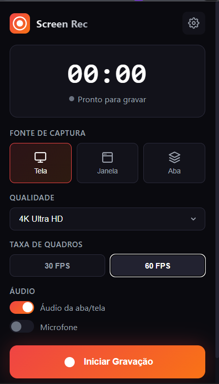

# Gravador de Tela Pro

&nbsp;&nbsp; &nbsp;&nbsp; &nbsp;&nbsp; &nbsp;&nbsp; 



Extensão para Google Chrome desenvolvida em Manifest V3 para captura de tela, janelas ou abas. Realiza todo o processamento de mídia localmente utilizando a API `MediaRecorder` e Documentos Offscreen, suportando resoluções até 4K e mixagem de áudio (sistema e microfone).

## Funcionalidades

- **Captura de Vídeo**: Suporte a resoluções 720p, 1080p, 1440p e 4K.
- **Taxa de Quadros**: Configurável entre 30 FPS e 60 FPS.
- **Codecs**: Suporte a VP9, VP8 e H.264 (conforme disponibilidade do navegador).
- **Exportação MP4**: Conversão para MP4 H.264 com taxa de quadros constante (CFR) para compatibilidade com editores como DaVinci Resolve e Premiere Pro.
- **Mixagem de Áudio**: Utiliza `AudioContext` para combinar áudio da aba/sistema com o microfone, com controle de volume independente.
- **Processamento Local**: Gera arquivos `.webm` ou `.mp4` diretamente no cliente, sem envio de dados para servidores externos.
- **Feedback Visual**: Badge no ícone indicando tempo de gravação ou estado de pausa.

## Requisitos

- Navegador baseado em Chromium (Google Chrome, Edge, Brave, etc).
- **Versão Mínima**: Chrome 116 (conforme definido em `manifest.json`).

## Instalação

Como o projeto não possui um empacotador (`package.json`), a instalação é feita via carregamento direto da fonte:

1. Clone este repositório.
2. Abra o navegador e acesse `chrome://extensions`.
3. Ative o **Modo do desenvolvedor** no canto superior direito.
4. Clique no botão **Carregar sem compactação** (Load unpacked).
5. Selecione a pasta raiz do projeto clonado.

## Uso

### Interface Gráfica

Clique no ícone da extensão na barra de ferramentas ou utilize o atalho configurado para abrir o popup de controle.

### Atalhos de Teclado (Padrão)

Os atalhos são definidos no `manifest.json` e podem ser alterados em `chrome://extensions/shortcuts`.

- `Alt + Shift + R`: Abrir popup da extensão.
- `Alt + Shift + S`: Iniciar ou Parar a gravação (toggle).

### Configurações

Acesse a página de opções (botão de engrenagem no popup) para ajustar:

- Qualidade padrão e FPS.
- Codec preferencial.
- **Formato de saída** (WebM ou MP4).
- Fontes de áudio e volumes.
- Contagem regressiva e salvamento automático.
- Padrão de nomenclatura do arquivo (ex: `gravacao_{date}_{time}`).


## Estrutura do Projeto

```
/
├── background.js          # Service Worker: Gerencia estado global, timer e badge
├── manifest.json          # Definições da extensão (Permissões, Versão, Assets)
├── icons/                 # Ícones da aplicação e estados de gravação
├── offscreen/             # Contexto para acesso ao DOM e MediaRecorder API
│   ├── offscreen.html
│   ├── offscreen.js       # Lógica de captura, mixagem de áudio e Blob
│   └── ffmpeg-converter.js # Módulo de conversão WebM → MP4
├── options/               # Página de configurações completas
│   ├── options.html
│   ├── options.css
│   └── options.js
├── popup/                 # Interface rápida de controle
│   ├── popup.html
│   ├── popup.css
│   └── popup.js
├── public/                # Assets estáticos para documentação
└── utils/                 # Constantes e funções utilitárias compartilhadas
```

## FAQ Técnico

### Por que utilizar Documentos Offscreen?

O Manifest V3 substituiu as _background pages_ por _Service Workers_, que não possuem acesso ao DOM nem às APIs de mídia (`MediaRecorder`, `AudioContext`). O projeto utiliza `chrome.offscreen` (`offscreen/offscreen.html`) para criar um ambiente oculto onde a captura e processamento do stream ocorrem.

### Como funciona a mixagem de áudio?

Em `offscreen.js`, quando ambas as fontes (sistema e microfone) estão ativas, a extensão cria um `AudioContext`. Os streams de áudio são convertidos em nós de mídia (`createMediaStreamSource`), passam por nós de ganho (`GainNode`) para controle de volume e são mesclados em um único destino (`createMediaStreamDestination`) antes de serem anexados ao `MediaRecorder`.

### Como funciona a conversão para MP4?

Quando o formato MP4 é selecionado, o vídeo é gravado normalmente em WebM e, ao finalizar, o módulo `ffmpeg-converter.js` utiliza FFmpeg.wasm para converter o arquivo para MP4 H.264 com:

- Taxa de quadros constante (CFR) - resolve problemas de VFR em editores
- Codec de vídeo libx264 (H.264)
- Codec de áudio AAC @ 128kbps
- Flag `faststart` para otimização de streaming

> **Nota**: O FFmpeg.wasm (~31MB) é baixado do CDN na primeira conversão.
