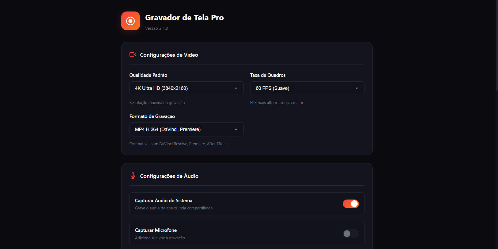
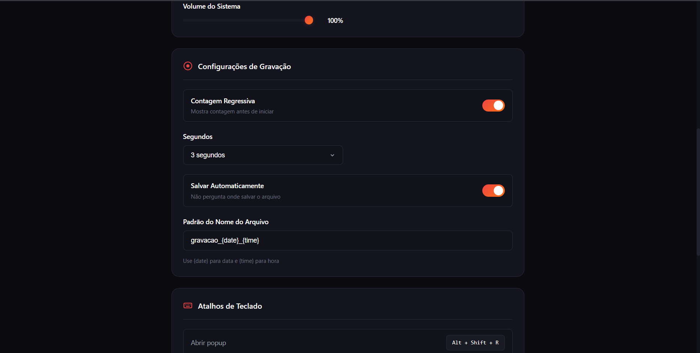
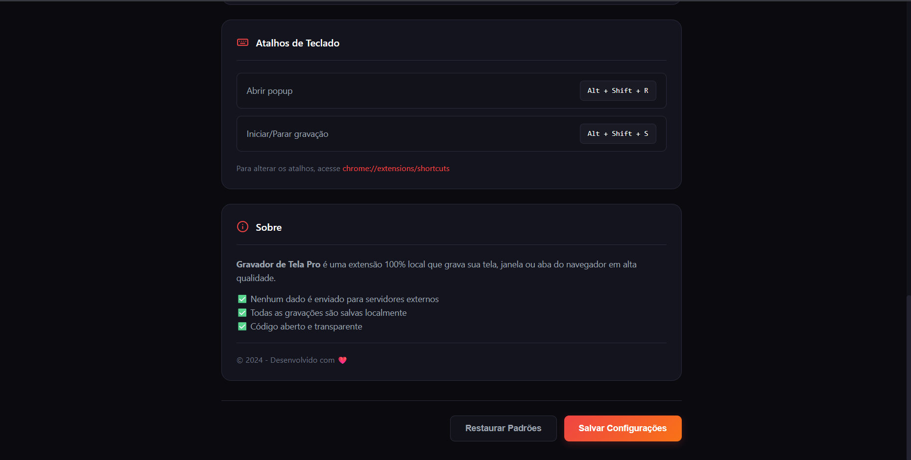

# 🎬 Gravador de Tela Pro

Uma extensão Chrome de código aberto para gravação de tela em alta qualidade, com suporte a **MP4 H.264 CFR** nativo via WebCodecs, eliminando a necessidade de reprocessamento ou conversão externa.


## ✨ Funcionalidades

- 🖥️ **Gravação de tela, janela ou aba** - Escolha exatamente o que quer capturar
- 🎯 **Até 4K 60fps** - Qualidade profissional
- 📹 **MP4 H.264 CFR** - Compatível com DaVinci Resolve, Premiere e outros editores
- 🎵 **Áudio do sistema + microfone** - Com controle de volume individual
- ⚡ **WebCodecs nativo** - Sem conversão posterior, gravação direta em MP4
- 🔒 **100% local** - Nenhum dado enviado para servidores externos
- ⌨️ **Atalhos de teclado** - `Alt+Shift+R` para abrir, `Alt+Shift+S` para gravar/parar

## 📸 Screenshots

<div align="center">
  
  <p><em>Interface principal do popup</em></p>
</div>

<div align="center">
  
  
  
  <p><em>Página de configurações</em></p>
</div>

## 📦 Formatos Suportados

| Formato  | Codec              | CFR    | Uso                                     |
| -------- | ------------------ | ------ | --------------------------------------- |
| **MP4**  | H.264 High Profile | ✅ Sim | Edição profissional (DaVinci, Premiere) |
| **WebM** | VP9                | ❌ VFR | Web, compartilhamento rápido            |

## 🚀 Instalação

Como este projeto é uma extensão não compactada, a instalação deve ser feita manualmente via modo de desenvolvedor:

1. Baixe ou clone este repositório para uma pasta local.
2. Abra o navegador Chrome e acesse `chrome://extensions`.
3. Ative a opção **"Modo do desenvolvedor"** no canto superior direito.
4. Clique no botão **"Carregar sem compactação"** (Load unpacked).
5. Selecione a pasta raiz do projeto (`gravador-de-tela/`).

## 🎮 Como Usar

1. Clique no ícone da extensão na barra de ferramentas
2. Selecione a **fonte de captura** (Tela, Janela ou Aba)
3. Escolha a **qualidade** (720p até 4K)
4. Selecione o **formato** (MP4 ou WebM)
5. Configure o **áudio** (sistema e/ou microfone)
6. Clique em **Iniciar Gravação**
7. Selecione a tela/janela/aba desejada
8. Clique novamente para **Parar**

O arquivo será salvo automaticamente na pasta de downloads.

## ⚙️ Configurações

Acesse as configurações clicando no ícone ⚙️ no popup:

- **Nome do arquivo** - Padrão customizável com `{date}` e `{time}`
- **Salvar automaticamente** - Sem diálogo de "Salvar como"
- **Contagem regressiva** - 3, 5 ou 10 segundos antes de iniciar

## 🛠️ Tecnologias

- **Manifest V3** - Arquitetura moderna de extensões Chrome
- **WebCodecs API** - Encoding H.264 nativo via GPU
- **mp4-muxer** - Muxing MP4 leve (~30KB)
- **MediaRecorder API** - Fallback para WebM
- **Offscreen Document** - Processamento em background

## 📁 Estrutura do Projeto

```
gravador-de-tela/
├── manifest.json          # Definição da extensão (Permissões, Versão, V3)
├── background.js          # Service Worker: Gerenciamento de estado e eventos
├── popup/                 # Interface principal (UI de controle)
├── options/               # Página de configurações (Resolução, Codecs)
├── offscreen/             # Processamento de mídia em background
│   ├── offscreen.html     # Contexto DOM para WebCodecs
│   ├── offscreen.js       # Lógica de encoding e muxing
│   └── mp4-muxer.min.js   # Biblioteca para container MP4
└── utils/                 # Constantes e helpers compartilhados
```

## 🔧 Requisitos

- **Google Chrome 116+** ou navegador baseado em Chromium
- Suporte a **WebCodecs API** (nativo no Chrome)

## 📝 Changelog

### v2.1.0 (Atual)

- ✨ Gravação MP4 H.264 CFR nativa via WebCodecs
- ✨ Sem necessidade de conversão posterior
- ✨ Interface simplificada
- 🗑️ Removido FFmpeg.wasm (era 24MB!)
- 🐛 Corrigido suporte a 4K 60fps

### v1.x

- Versões anteriores usavam MediaRecorder + conversão FFmpeg

## 📄 Licença

Este projeto está licenciado sob a [MIT License](LICENSE).

## 🤝 Contribuindo

Contribuições são bem-vindas! Por favor:

1. Faça um fork do projeto
2. Crie uma branch para sua feature (`git checkout -b feature/nova-feature`)
3. Commit suas mudanças (`git commit -m 'Adiciona nova feature'`)
4. Push para a branch (`git push origin feature/nova-feature`)
5. Abra um Pull Request

## 🐛 Reportando Bugs

Encontrou um bug? Abra uma [issue](https://github.com/seu-usuario/gravador-de-tela/issues) com:

- Descrição do problema
- Passos para reproduzir
- Versão do Chrome
- Console logs (se houver erros)

---

## FAQ Técnico

**Por que utilizar um Offscreen Document?**

O Service Worker (padrão no Manifest V3) não possui acesso direto ao DOM (`window` ou `document`), o que impede o uso de certas APIs de mídia. O arquivo `offscreen/offscreen.html` é criado dinamicamente para hospedar o contexto necessário para a `WebCodecs API` e o processamento de streams de áudio/vídeo, mantendo a gravação ativa mesmo se o popup for fechado.

**Qual a diferença entre o modo WebCodecs e MediaRecorder?**

- **WebCodecs (Padrão MP4):** Permite controle frame-a-frame da codificação. Isso garante que o arquivo final seja H.264 com Constant Frame Rate (CFR), essencial para compatibilidade com editores de vídeo como Premiere e DaVinci Resolve.
- **MediaRecorder (Fallback WebM):** API de alto nível que geralmente grava em Variable Frame Rate (VFR) e codecs VP8/VP9. É usado apenas se a aceleração de hardware H.264 não estiver disponível.

---

**Esse README foi feito com [Buildmydocs](https://buildmydocs.dev)**
